# 全画面の状態遷移図（Screen State Atlas）

**種別: 規範的な画面状態遷移設計。** [全画面・ボタン台帳](SCREEN-CONTROL-CATALOG.md)にある論理画面IDとコントロールを状態遷移図へ対応させる。各図のURL/permissionは [URL・API認可](../architecture/ROUTE-AUTHORIZATION-CONTRACT.md) を正本とする。各見出しは画面の実装範囲や採用状態を示す。稼働環境での受入には、図に示す操作を対象環境で確認した証拠を要する。

読み方: 四角は画面/状態、ひし形は認証・入力・保存の分岐、矢印は実操作やサーバー結果による遷移。例外時は元の作業・下書き・認可の境界を保ち、隠れた別の書込経路へ転換しない。各画面のボタン名は `CTRL ID` を参照。共通の操作禁止/403/409/失敗の契約は台帳に委任し、各図ではその画面特有の戻り先を記載する。

## ENTRY-01 — Desktop React Web / iOS SwiftUI起動【採用目標】

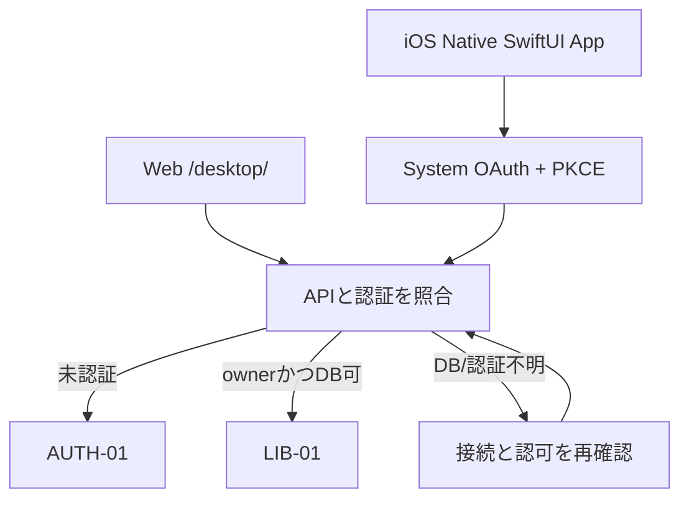
```mermaid
flowchart TD
    WEB["Web /desktop/"] --> SESSION["APIと認証を照合"]
    IOS["iOS Native SwiftUI App"] --> PKCE["System OAuth + PKCE"]
    PKCE --> SESSION
    SESSION -->|未認証| SIGNIN["AUTH-01"]
    SESSION -->|ownerかつDB可| LIBRARY["LIB-01"]
    SESSION -->|DB/認証不明| RETRY["接続と認可を再確認"]
    RETRY --> SESSION
```

現行mainのWeb入口はDesktopのみで、Mobile Web shellと`/mobile/` routeは製品導線から撤去済みである。Native iOSは別NavigationStackとprotected draft journalを所有する設計目標で、実装・実機受入は未完了のまま開発と自動Xcode検証が一時停止中である。

## AUTH-01 — Passkey / OIDC本人ログイン【実装】

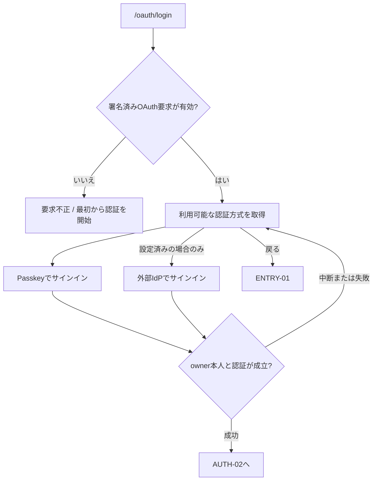
```mermaid
flowchart TD
    OPEN["/oauth/login"] --> REQUEST{"署名済みOAuth要求が有効?"}
    REQUEST -->|いいえ| INVALID["要求不正 / 最初から認証を開始"]
    REQUEST -->|はい| METHODS["利用可能な認証方式を取得"]
    METHODS --> PASS["Passkeyでサインイン"]
    METHODS -->|設定済みの場合のみ| OIDC["外部IdPでサインイン"]
    PASS --> CHECK{"owner本人と認証が成立?"}
    OIDC --> CHECK
    CHECK -->|成功| CONSENT["AUTH-02へ"]
    CHECK -->|中断または失敗| METHODS
    METHODS -->|戻る| ENTRY["ENTRY-01"]
```

## AUTH-02 — OAuth client/scope同意【実装】

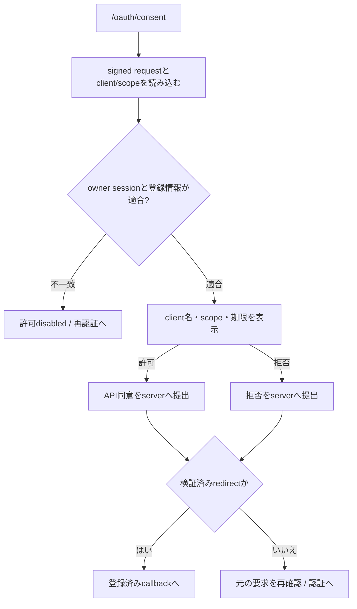
```mermaid
flowchart TD
    OPEN["/oauth/consent"] --> LOAD["signed requestとclient/scopeを読み込む"]
    LOAD --> VERIFY{"owner sessionと登録情報が適合?"}
    VERIFY -->|不一致| DENY["許可disabled / 再認証へ"]
    VERIFY -->|適合| REVIEW["client名・scope・期限を表示"]
    REVIEW -->|許可| GRANT["API同意をserverへ提出"]
    REVIEW -->|拒否| REFUSE["拒否をserverへ提出"]
    GRANT --> RESULT{"検証済みredirectか"}
    REFUSE --> RESULT
    RESULT -->|はい| CALLBACK["登録済みcallbackへ"]
    RESULT -->|いいえ| ERROR["元の要求を再確認 / 認証へ"]
```

## LIB-01 — 作品一覧・作成・インポート/エクスポート【実装】

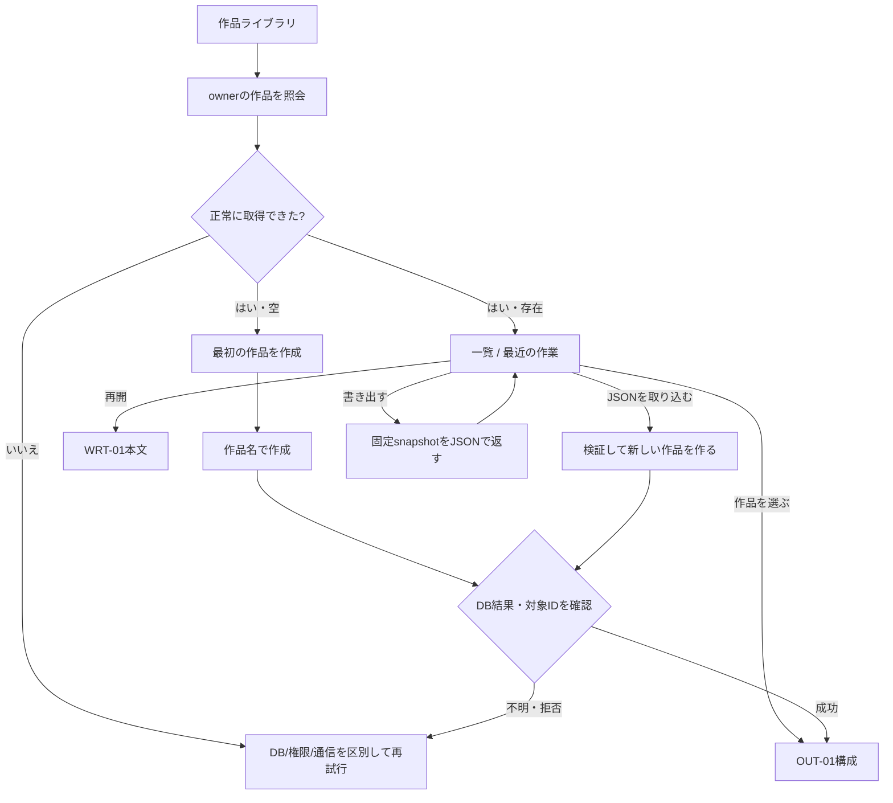
```mermaid
flowchart TD
    OPEN["作品ライブラリ"] --> LIST["ownerの作品を照会"]
    LIST --> STATE{"正常に取得できた?"}
    STATE -->|いいえ| RETRY["DB/権限/通信を区別して再試行"]
    STATE -->|はい・空| EMPTY["最初の作品を作成"]
    STATE -->|はい・存在| ITEMS["一覧 / 最近の作業"]
    EMPTY --> CREATE["作品名で作成"]
    ITEMS -->|作品を選ぶ| OUTLINE["OUT-01構成"]
    ITEMS -->|再開| WRITE["WRT-01本文"]
    ITEMS -->|JSONを取り込む| IMPORT["検証して新しい作品を作る"]
    ITEMS -->|書き出す| EXPORT["固定snapshotをJSONで返す"]
    CREATE --> CHECK{"DB結果・対象IDを確認"}
    IMPORT --> CHECK
    CHECK -->|成功| OUTLINE
    CHECK -->|不明・拒否| RETRY
    EXPORT --> ITEMS
```

## OUT-01 — 巻/章/シーンの構成・変更【実装】

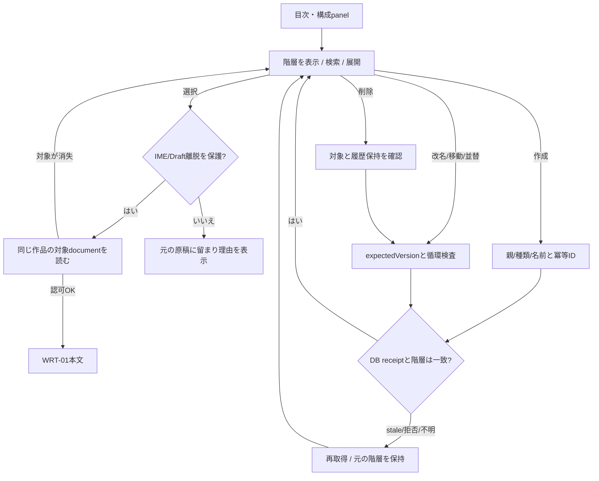
```mermaid
flowchart TD
    OPEN["目次・構成panel"] --> TREE["階層を表示 / 検索 / 展開"]
    TREE -->|選択| GUARD{"IME/Draft離脱を保護?"}
    GUARD -->|はい| OPEN_DOC["同じ作品の対象documentを読む"]
    GUARD -->|いいえ| BLOCK["元の原稿に留まり理由を表示"]
    OPEN_DOC -->|認可OK| WRITE["WRT-01本文"]
    OPEN_DOC -->|対象が消失| TREE
    TREE -->|作成| CREATE["親/種類/名前と冪等ID"]
    TREE -->|改名/移動/並替| CHANGE["expectedVersionと循環検査"]
    TREE -->|削除| CONFIRM["対象と履歴保持を確認"]
    CONFIRM --> CHANGE
    CREATE --> RESULT{"DB receiptと階層は一致?"}
    CHANGE --> RESULT
    RESULT -->|はい| TREE
    RESULT -->|stale/拒否/不明| RECHECK["再取得 / 元の階層を保持"]
    RECHECK --> TREE
```

## WRT-01 — 原稿執筆と保存【実装】

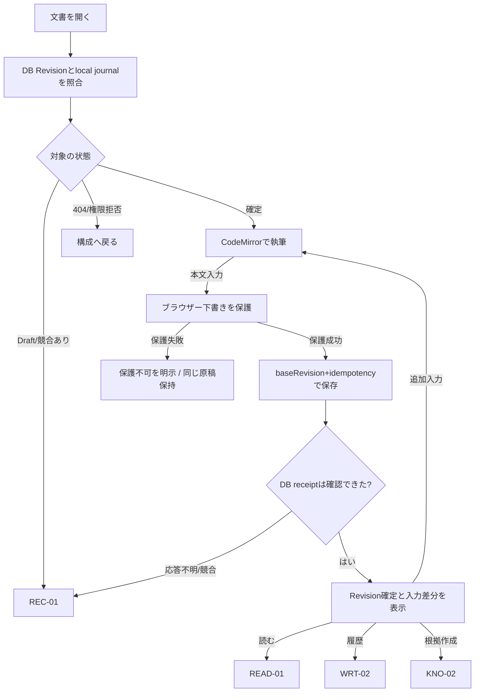
```mermaid
flowchart TD
    OPEN["文書を開く"] --> FETCH["DB Revisionとlocal journalを照合"]
    FETCH --> STATE{"対象の状態"}
    STATE -->|確定| EDIT["CodeMirrorで執筆"]
    STATE -->|Draft/競合あり| RECOVER["REC-01"]
    STATE -->|404/権限拒否| OUTLINE["構成へ戻る"]
    EDIT -->|本文入力| JOURNAL["ブラウザー下書きを保護"]
    JOURNAL -->|保護成功| SAVE["baseRevision+idempotencyで保存"]
    JOURNAL -->|保護失敗| RISK["保護不可を明示 / 同じ原稿保持"]
    SAVE --> RESULT{"DB receiptは確認できた?"}
    RESULT -->|はい| CONFIRMED["Revision確定と入力差分を表示"]
    RESULT -->|応答不明/競合| RECOVER
    CONFIRMED -->|追加入力| EDIT
    CONFIRMED -->|読む| READING["READ-01"]
    CONFIRMED -->|履歴| HIST["WRT-02"]
    CONFIRMED -->|根拠作成| KNOW["KNO-02"]
```

## READ-01 — 同じ原稿の読書モード【実装】

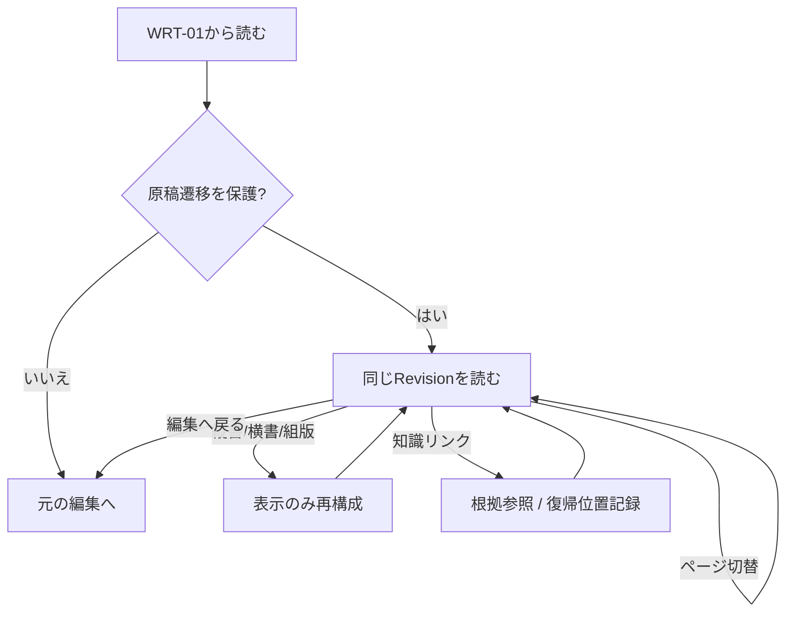
```mermaid
flowchart TD
    ENTRY["WRT-01から読む"] --> GUARD{"原稿遷移を保護?"}
    GUARD -->|いいえ| EDIT["元の編集へ"]
    GUARD -->|はい| PAGE["同じRevisionを読む"]
    PAGE -->|縦書/横書/組版| STYLE["表示のみ再構成"]
    STYLE --> PAGE
    PAGE -->|ページ切替| PAGE
    PAGE -->|知識リンク| REF["根拠参照 / 復帰位置記録"]
    REF --> PAGE
    PAGE -->|編集へ戻る| EDIT
```

## WRT-02 — Revisionの閲覧・復元【実装】

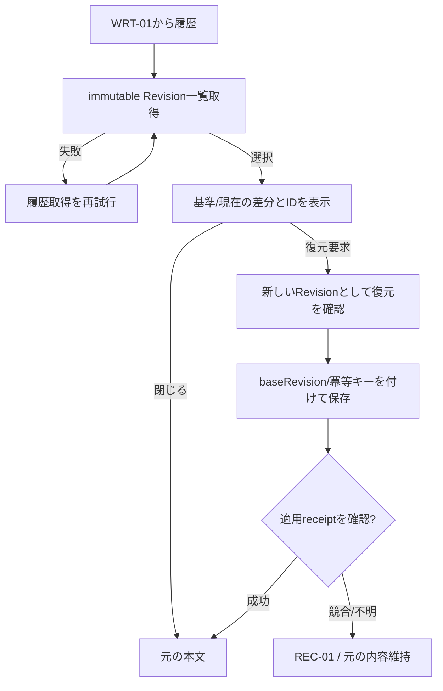
```mermaid
flowchart TD
    ENTRY["WRT-01から履歴"] --> LOAD["immutable Revision一覧取得"]
    LOAD -->|失敗| RETRY["履歴取得を再試行"]
    RETRY --> LOAD
    LOAD -->|選択| DIFF["基準/現在の差分とIDを表示"]
    DIFF -->|閉じる| EDIT["元の本文"]
    DIFF -->|復元要求| CONFIRM["新しいRevisionとして復元を確認"]
    CONFIRM --> APPLY["baseRevision/冪等キーを付けて保存"]
    APPLY --> RESULT{"適用receiptを確認?"}
    RESULT -->|成功| EDIT
    RESULT -->|競合/不明| RECOVER["REC-01 / 元の内容維持"]
```

## REC-01 — Draft、競合、応答不明の復旧【実装】

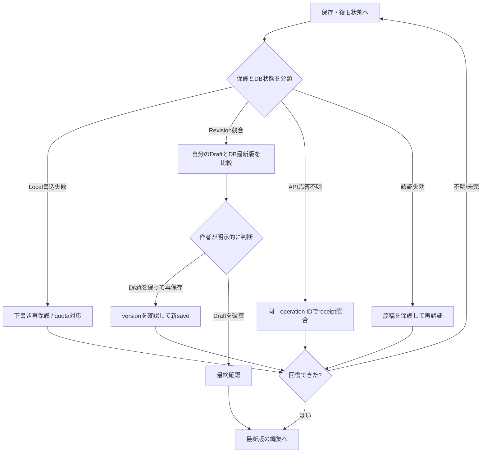
```mermaid
flowchart TD
    ENTRY["保存・復旧状態へ"] --> TYPE{"保護とDB状態を分類"}
    TYPE -->|Local書込失敗| LOCAL["下書き再保護 / quota対応"]
    TYPE -->|Revision競合| CONFLICT["自分のDraftとDB最新版を比較"]
    TYPE -->|API応答不明| RECEIPT["同一operation IDでreceipt照合"]
    TYPE -->|認証失効| LOGIN["原稿を保護して再認証"]
    LOCAL --> CHECK{"回復できた?"}
    RECEIPT --> CHECK
    LOGIN --> CHECK
    CONFLICT --> CHOICE{"作者が明示的に判断"}
    CHOICE -->|Draftを保って再保存| REBASE["versionを確認して新save"]
    CHOICE -->|Draftを破棄| CONFIRM["最終確認"]
    CONFIRM --> EDIT["最新版の編集へ"]
    REBASE --> CHECK
    CHECK -->|はい| EDIT
    CHECK -->|不明/未完| ENTRY
```

## KNO-01 — Knowledge検索・候補登録【実装】

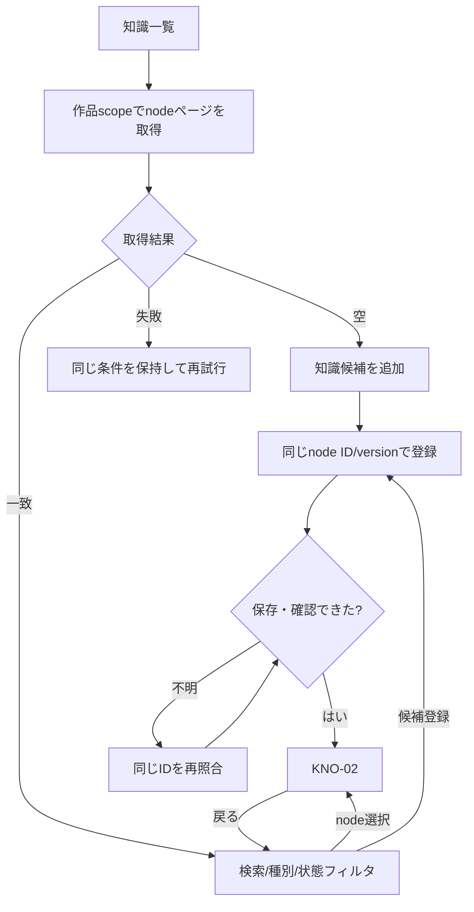
```mermaid
flowchart TD
    ENTRY["知識一覧"] --> READ["作品scopeでnodeページを取得"]
    READ --> STATE{"取得結果"}
    STATE -->|空| EMPTY["知識候補を追加"]
    STATE -->|一致| LIST["検索/種別/状態フィルタ"]
    STATE -->|失敗| ERROR["同じ条件を保持して再試行"]
    LIST -->|node選択| DETAIL["KNO-02"]
    LIST -->|候補登録| CREATE["同じnode ID/versionで登録"]
    EMPTY --> CREATE
    CREATE --> RESULT{"保存・確認できた?"}
    RESULT -->|はい| DETAIL
    RESULT -->|不明| RECHECK["同じIDを再照合"]
    RECHECK --> RESULT
    DETAIL -->|戻る| LIST
```

## KNO-02 — Knowledge・Text Anchor・関係・統合【実装】

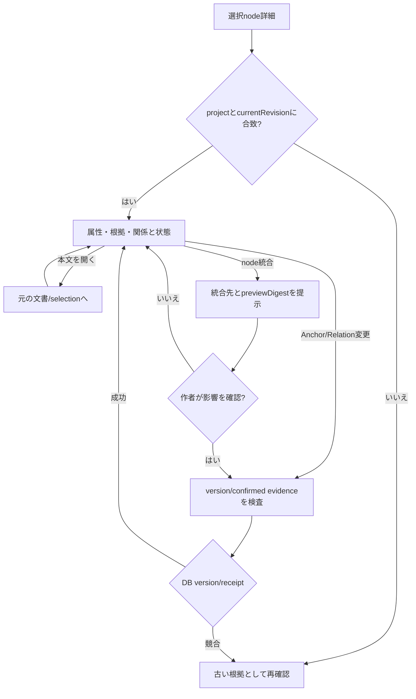
```mermaid
flowchart TD
    ENTRY["選択node詳細"] --> AUTH{"projectとcurrentRevisionに合致?"}
    AUTH -->|いいえ| RECHECK["古い根拠として再確認"]
    AUTH -->|はい| DETAIL["属性・根拠・関係と状態"]
    DETAIL -->|本文を開く| MANUSCRIPT["元の文書/selectionへ"]
    MANUSCRIPT --> DETAIL
    DETAIL -->|Anchor/Relation変更| PROPOSE["version/confirmed evidenceを検査"]
    DETAIL -->|node統合| PREVIEW["統合先とpreviewDigestを提示"]
    PREVIEW --> CONFIRM{"作者が影響を確認?"}
    CONFIRM -->|はい| PROPOSE
    CONFIRM -->|いいえ| DETAIL
    PROPOSE --> RESULT{"DB version/receipt"}
    RESULT -->|成功| DETAIL
    RESULT -->|競合| RECHECK
```

## REV-01 — 提案・ChangeSet一覧【実装】

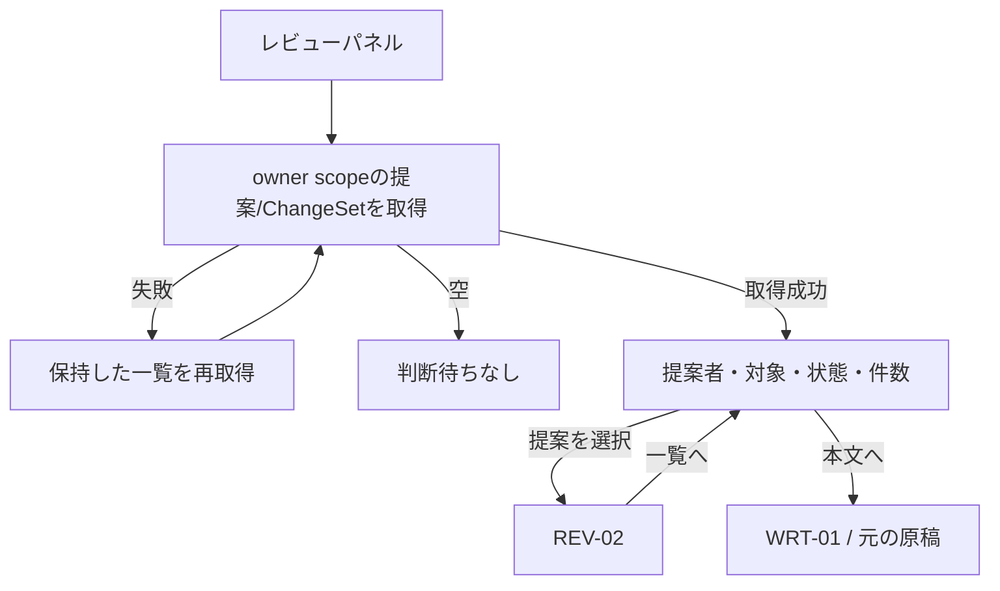
```mermaid
flowchart TD
    ENTRY["レビューパネル"] --> FEED["owner scopeの提案/ChangeSetを取得"]
    FEED -->|失敗| RETRY["保持した一覧を再取得"]
    RETRY --> FEED
    FEED -->|空| EMPTY["判断待ちなし"]
    FEED -->|取得成功| LIST["提案者・対象・状態・件数"]
    LIST -->|提案を選択| DETAIL["REV-02"]
    DETAIL -->|一覧へ| LIST
    LIST -->|本文へ| WRITE["WRT-01 / 元の原稿"]
```

## REV-02 — 提案の比較・作者承認/適用【実装】

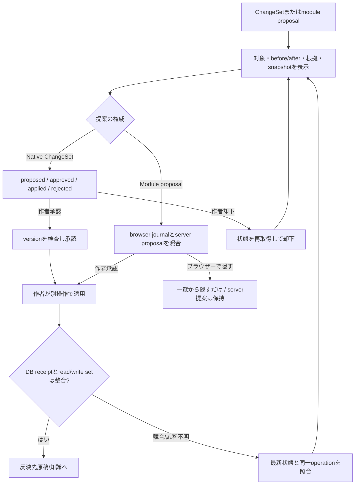
```mermaid
flowchart TD
    ENTRY["ChangeSetまたはmodule proposal"] --> DIFF["対象・before/after・根拠・snapshotを表示"]
    DIFF --> TYPE{"提案の権威"}
    TYPE -->|Native ChangeSet| NATIVE["proposed / approved / applied / rejected"]
    TYPE -->|Module proposal| MODULE["browser journalとserver proposalを照合"]
    NATIVE -->|作者承認| APPROVE["versionを検査し承認"]
    NATIVE -->|作者却下| REJECT["状態を再取得して却下"]
    APPROVE --> APPLY["作者が別操作で適用"]
    MODULE -->|作者承認| APPLY
    MODULE -->|ブラウザーで隠す| HIDE["一覧から隠すだけ / server提案は保持"]
    APPLY --> RESULT{"DB receiptとread/write setは整合?"}
    RESULT -->|はい| WRITE["反映先原稿/知識へ"]
    RESULT -->|競合/応答不明| RECHECK["最新状態と同一operationを照合"]
    REJECT --> DIFF
    RECHECK --> DIFF
```

## TOOL-01 — 任意モジュールと背景処理【実装】

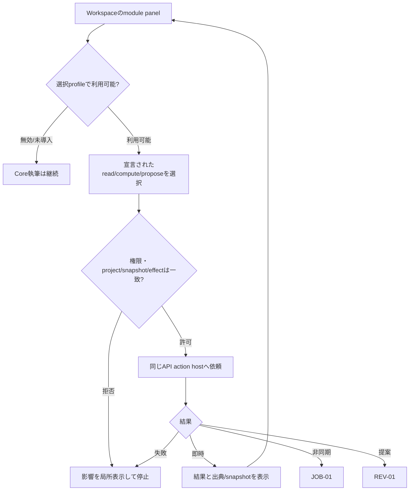
```mermaid
flowchart TD
    ENTRY["Workspaceのmodule panel"] --> AVAILABLE{"選択profileで利用可能?"}
    AVAILABLE -->|無効/未導入| CORE["Core執筆は継続"]
    AVAILABLE -->|利用可能| ACTION["宣言されたread/compute/proposeを選択"]
    ACTION --> GUARD{"権限・project/snapshot/effectは一致?"}
    GUARD -->|拒否| ERROR["影響を局所表示して停止"]
    GUARD -->|許可| EXEC["同じAPI action hostへ依頼"]
    EXEC --> RESULT{"結果"}
    RESULT -->|即時| VIEW["結果と出典/snapshotを表示"]
    RESULT -->|非同期| JOB["JOB-01"]
    RESULT -->|提案| REVIEW["REV-01"]
    RESULT -->|失敗| ERROR
    VIEW --> ENTRY
```

## JOB-01 — 受信箱・ジョブ履歴【実装】

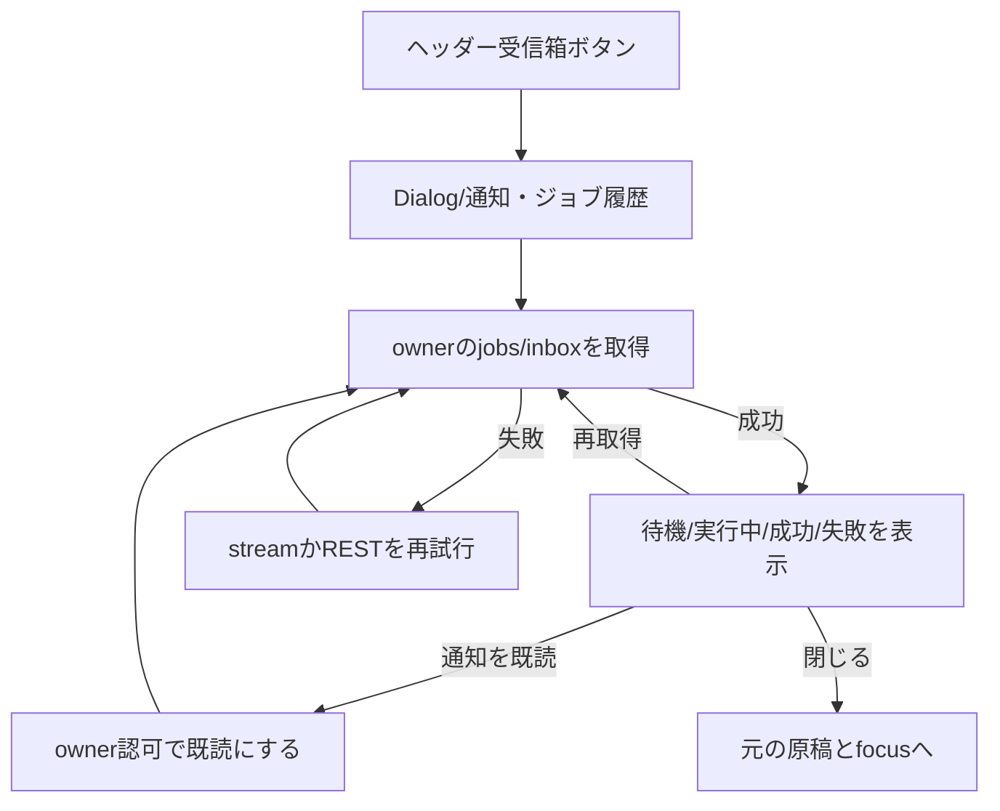
```mermaid
flowchart TD
    ENTRY["ヘッダー受信箱ボタン"] --> DIALOG["Dialog/通知・ジョブ履歴"]
    DIALOG --> GET["ownerのjobs/inboxを取得"]
    GET -->|成功| LIST["待機/実行中/成功/失敗を表示"]
    GET -->|失敗| RETRY["streamかRESTを再試行"]
    RETRY --> GET
    LIST -->|通知を既読| MARK["owner認可で既読にする"]
    MARK --> GET
    LIST -->|再取得| GET
    LIST -->|閉じる| RETURN["元の原稿とfocusへ"]
```

## DISPLAY-01・PREF-01 — 表示設定・現行本人設定【実装】

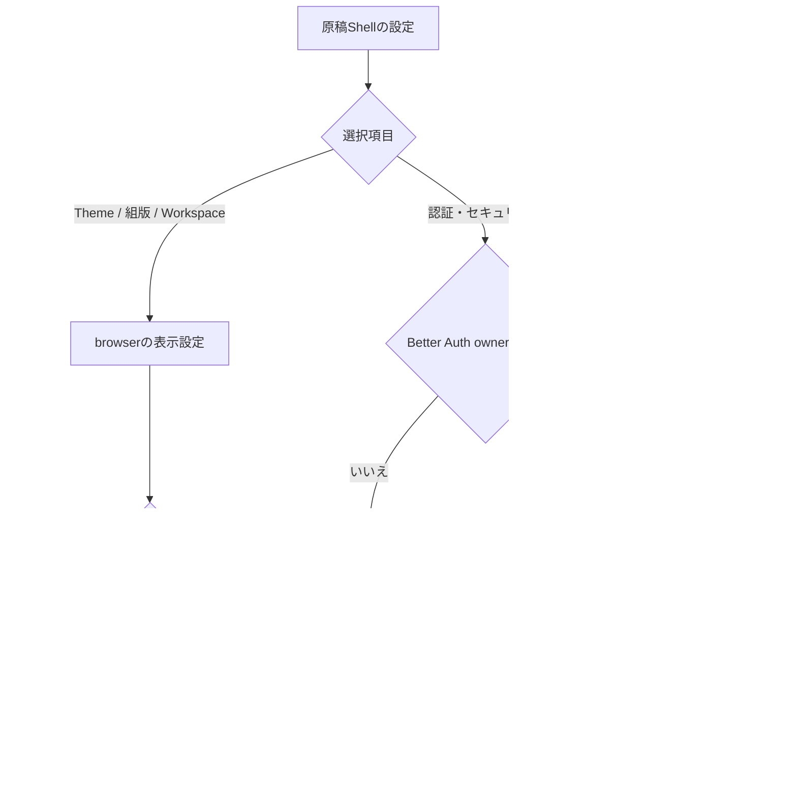
```mermaid
flowchart TD
    ENTRY["原稿Shellの設定"] --> TYPE{"選択項目"}
    TYPE -->|Theme / 組版 / Workspace| LOCAL["browserの表示設定"]
    LOCAL --> CHECK{"設定を保存できた?"}
    CHECK -->|はい| RETURN["同じ原稿/scrollへ"]
    CHECK -->|いいえ| NOTICE["保存失敗を表示 / 原稿は維持"]
    TYPE -->|認証・セキュリティ| OWNER{"Better Auth owner session?"}
    OWNER -->|いいえ| LOGIN["下書きを守って再認証"]
    OWNER -->|はい| PANEL["Desktop Web dialog（旧Mobile設定routeは撤去済み）"]
    PANEL -->|Passkey/session操作| VERIFY["server認可・fresh proof・結果再取得"]
    VERIFY --> PANEL
    PANEL -->|閉じる| RETURN
```

## PUB-01 — 公開読者の読書ビュー【実装】

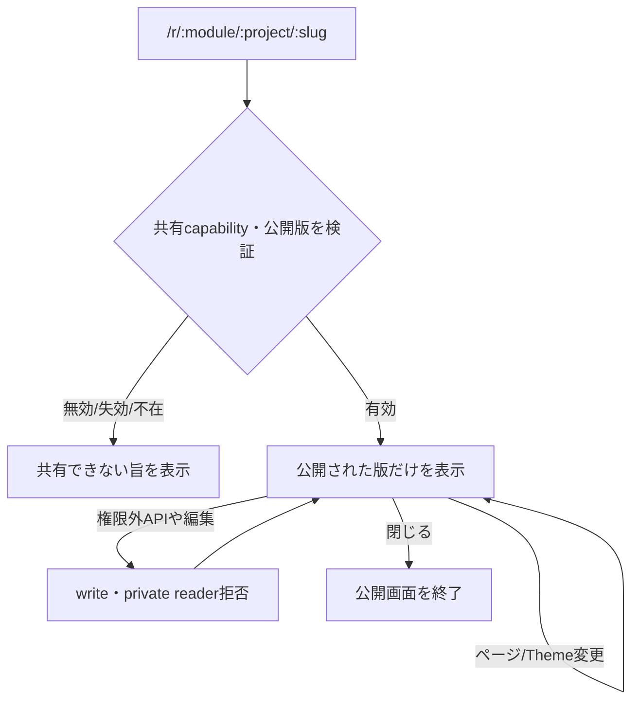
```mermaid
flowchart TD
    ENTRY["/r/:module/:project/:slug"] --> PUBLIC{"共有capability・公開版を検証"}
    PUBLIC -->|無効/失効/不在| NOTFOUND["共有できない旨を表示"]
    PUBLIC -->|有効| VIEW["公開された版だけを表示"]
    VIEW -->|ページ/Theme変更| VIEW
    VIEW -->|権限外APIや編集| DENY["write・private reader拒否"]
    DENY --> VIEW
    VIEW -->|閉じる| END["公開画面を終了"]
```

## CON-00 — 管理コンソールHome【Desktop Web 実装】

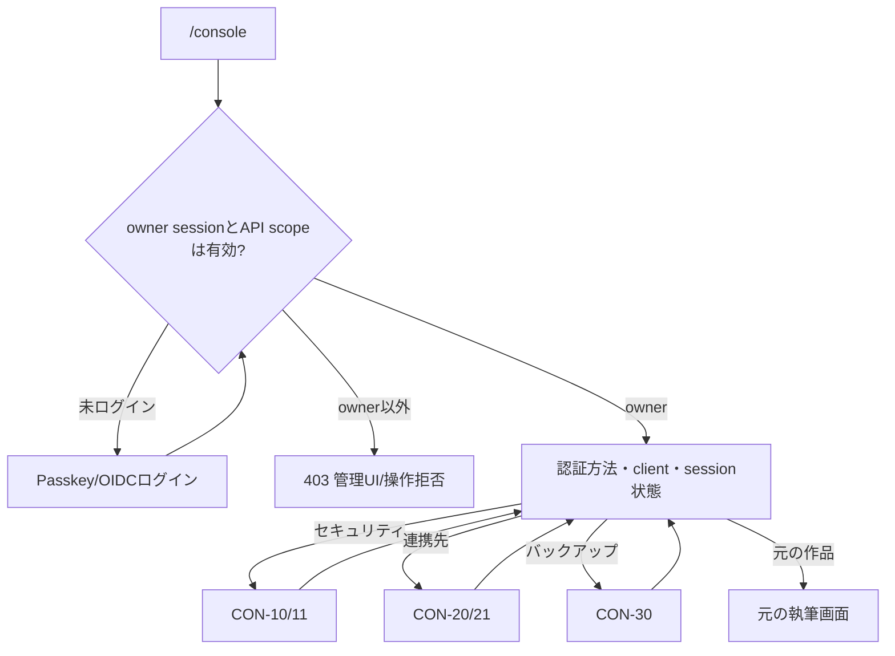
```mermaid
flowchart TD
    ENTRY["/console"] --> SESSION{"owner sessionとAPI scopeは有効?"}
    SESSION -->|未ログイン| LOGIN["Passkey/OIDCログイン"]
    SESSION -->|owner以外| DENY["403 管理UI/操作拒否"]
    LOGIN --> SESSION
    SESSION -->|owner| HOME["認証方法・client・session状態"]
    HOME -->|セキュリティ| SECURITY["CON-10/11"]
    HOME -->|連携先| IDENTITY["CON-20/21"]
    HOME -->|バックアップ| BACKUPS["CON-30"]
    BACKUPS --> HOME
    HOME -->|元の作品| AUTHOR["元の執筆画面"]
    SECURITY --> HOME
    IDENTITY --> HOME
```

## CON-01・CON-02・CON-03 — 初回登録ウィザード【Desktop Web 実装】

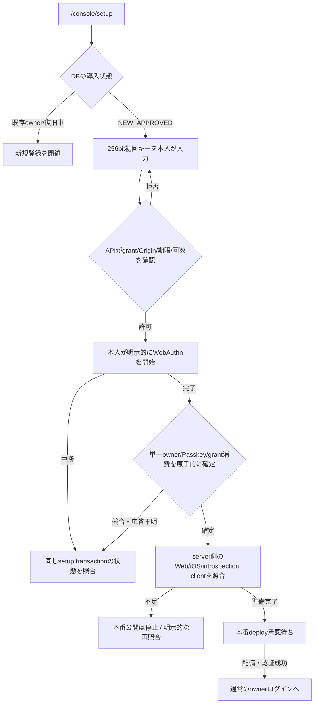
```mermaid
flowchart TD
    ENTRY["/console/setup"] --> STATUS{"DBの導入状態"}
    STATUS -->|既存owner/復旧中| BLOCK["新規登録を閉鎖"]
    STATUS -->|NEW_APPROVED| KEY["256bit初回キーを本人が入力"]
    KEY --> AUTHORIZE{"APIがgrant/Origin/期限/回数を確認"}
    AUTHORIZE -->|拒否| KEY
    AUTHORIZE -->|許可| CEREMONY["本人が明示的にWebAuthnを開始"]
    CEREMONY -->|中断| RETRY["同じsetup transactionの状態を照合"]
    CEREMONY -->|完了| COMMIT{"単一owner/Passkey/grant消費を原子的に確定"}
    COMMIT -->|競合・応答不明| RETRY
    COMMIT -->|確定| CLIENTS["server側のWeb/iOS/introspection clientを照合"]
    CLIENTS -->|不足| WAIT["本番公開は停止 / 明示的な再照合"]
    CLIENTS -->|準備完了| READY["本番deploy承認待ち"]
    READY -->|配備・認証成功| LOGIN["通常のownerログインへ"]
```

## CON-10 — Passkey管理【Desktop Web 実装】

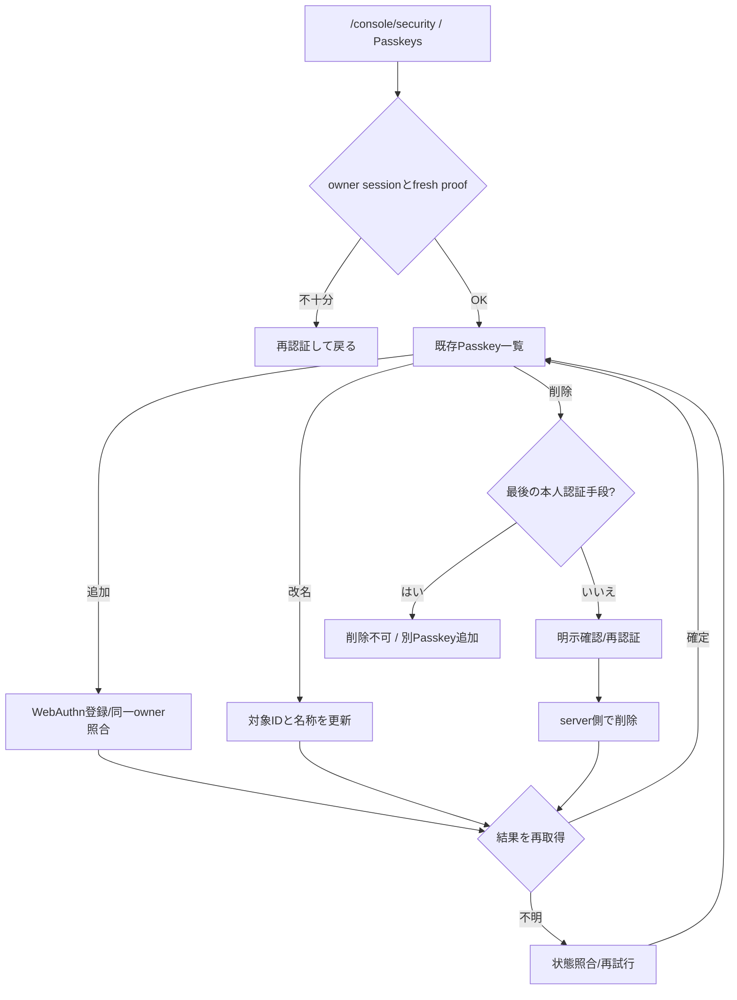
```mermaid
flowchart TD
    ENTRY["/console/security / Passkeys"] --> OWNER{"owner sessionとfresh proof"}
    OWNER -->|不十分| LOGIN["再認証して戻る"]
    OWNER -->|OK| LIST["既存Passkey一覧"]
    LIST -->|追加| ADD["WebAuthn登録/同一owner照合"]
    LIST -->|改名| RENAME["対象IDと名称を更新"]
    LIST -->|削除| LAST{"最後の本人認証手段?"}
    LAST -->|はい| DENY["削除不可 / 別Passkey追加"]
    LAST -->|いいえ| CONFIRM["明示確認/再認証"]
    CONFIRM --> DELETE["server側で削除"]
    ADD --> RESULT{"結果を再取得"}
    RENAME --> RESULT
    DELETE --> RESULT
    RESULT -->|確定| LIST
    RESULT -->|不明| RETRY["状態照合/再試行"]
    RETRY --> LIST
```

## CON-11 — セッション管理【Desktop Web 実装】

```mermaid
flowchart TD
    ENTRY["/console/security / Sessions"] --> LOAD["owner session一覧"]
    LOAD --> LIST["現在の端末と他端末を区別"]
    LIST -->|他セッション選択| CONFIRM["対象端末を確認"]
    LIST -->|全他端末終了| CONFIRMALL["現在の端末を残す"]
    LIST -->|自分の現在sessionを個別選択| BLOCK["個別revoke不可"]
    CONFIRM --> REVOKE["対象tokenを失効"]
    CONFIRMALL --> REVOKE
    REVOKE --> RESULT{"serverの失効結果を照合"}
    RESULT -->|成功| LOAD
    RESULT -->|不明/再認証必要| RETRY["同じ対象を照合・再ログイン"]
    RETRY --> LOAD
```

## CON-20・CON-21 — OIDCとOAuth client/同意【部分導入】

Desktop Web は、運用者による OIDC 設定の状態と保存済み OAuth 同意を表示し、Passkey での再認証後に対象の同意を取り消せる。
所有者による OIDC の登録、検証、有効化は採用目標である。[Owner OIDC 契約](../architecture/OWNER-OIDC-MANAGEMENT-CONTRACT.md)

```mermaid
flowchart TD
    ENTRY["/console/identity"] --> OWNER{"owner session＋fresh reauth"}
    OWNER -->|拒否| LOGIN["安全に再認証"]
    OWNER -->|OK| MENU["OIDC / OAuth clients / grants"]
    MENU -->|OIDC追加・変更| VALIDATE["issuer/discovery/redirect/subを検証"]
    VALIDATE -->|失敗| FIX["未有効のまま修正・再試行"]
    FIX --> VALIDATE
    VALIDATE -->|成功| LINK["同じownerへの検証済みlink"]
    LINK --> ACTIVATE["明示的に有効化"]
    MENU -->|同意一覧| GRANTS["client/scope/resource一覧"]
    GRANTS -->|revoke| CONFIRM["対象grantと影響を確認"]
    CONFIRM --> REVOKE["server側で失効を確定"]
    REVOKE --> GRANTS
    MENU -->|MCP client権限確認| MCP["server allowlistとproject assignmentを照合"]
    ACTIVATE --> MENU
    MCP --> MENU
```

## CON-30 — バックアップ管理トップ【Desktop Web 実装】

CON-30〜34 の操作はオペレーターが有効化した API と executor を使う。
実 S3 保管と独立復旧の受入は、配備環境ごとの証拠で判定する。[Backup console contract](../architecture/BACKUP-CONSOLE-CONTRACT.md)

```mermaid
flowchart TD
    ENTRY["/console/backups"] --> GUARD{"owner session / API owner確認"}
    GUARD -->|認証不足| AUTH["再認証して戻る・原稿下書き維持"]
    GUARD -->|許可| FETCH["status + configを再取得"]
    FETCH --> STATUS{"設定と遠隔保全の観測"}
    STATUS -->|未設定 / 未検証| CFG["CON-31 保存先設定"]
    STATUS -->|ACTIVE| READY["設定は適用済み<br/>保全実績とは独立"]
    STATUS -->|DEGRADED / UNKNOWN| WARN["不明・劣化の理由表示<br/>実測まで保護済みとしない"]
    READY -->|manual request + fresh| REQ["BKC-008 202 受付のみ"]
    REQ --> RUN["CON-33 run ID照合"]
    READY --> HIST["CON-33 保全履歴"]
    READY --> REC["CON-34 復旧演習の証拠"]
    CFG --> FETCH
    RUN --> FETCH
    HIST --> FETCH
    REC --> FETCH
```

## CON-31・CON-32 — S3設定・接続検証・有効化【Desktop Web 実装】

```mermaid
stateDiagram-v2
    [*] --> LoadDraft
    LoadDraft --> Editing : existing draft / new
    Editing --> Saving : BKC-003 + If-Match
    Saving --> Editing : 412 stale / 422 invalid
    Saving --> DraftSaved : revision確定
    DraftSaved --> Probing : BKC-004 / probe ID
    Probing --> ProbeFailed : FAILED / BLOCKED
    ProbeFailed --> Editing : 修正
    Probing --> ProbePassed : PASSED 同一revision
    ProbePassed --> Reauth : owner明示確認
    Reauth --> ActivationPending : BKC-006 / 202 operation ID
    Reauth --> Editing : reauth失敗・取消
    ActivationPending --> Active : actual executor ACTIVE receipt
    ActivationPending --> Unknown : timeout / reconnect
    Unknown --> ActivationPending : 同じoperation IDで照合
    ActivationPending --> Editing : 409 / 412 / FAILED
    Active --> [*]
```

draft保存・probe成功・202受理のどれも遠隔暗号文の保全済み証拠にはならない。資格情報はAPIへwrite-only送信され、再取得した応答に含まれない。起動時のlocal staging、age受取公開鍵、VM/IAM管理権限はUIから変更不可。検証用S3 probeと実backup objectは一意のprefix/IDで区別する。

## CON-33・CON-34 — バックアップ履歴・隔離復旧証拠【Desktop Web 実装】

```mermaid
flowchart TD
    ENTRY["/console/backups/history"] --> LOAD["BKC-009 run一覧"]
    LOAD --> PICK["run IDを選択"]
    PICK --> STATE{"server receiptのstatus"}
    STATE -->|QUEUED / RUNNING| POLL["同じrun IDで状態再取得"]
    STATE -->|UNKNOWN / 接続断| POLL
    POLL --> STATE
    STATE -->|FAILED / BLOCKED| DIAG["理由区分・保全不能を表示"]
    STATE -->|REMOTE_VERIFIED| REMOTE["暗号文/manifestと独立receipt一致<br/>off-VM保全点として表示"]
    REMOTE --> RESTORE["/console/backups/recovery"]
    RESTORE --> PROOF{"隔離hostでrestore drill済み?"}
    PROOF -->|はい| DR["DRILL_PASSED 対象と日時の証拠"]
    PROOF -->|いいえ| NODR["DR未認定。operator運用手順への導線"]
    DR --> DENY["本番復元ボタンは設けない"]
    NODR --> DENY
```

本図は実ジョブのreceiptを表示するUI状態の正本。実executor・復号・データ復元は [Backup console contract](../architecture/BACKUP-CONSOLE-CONTRACT.md) と [Backup](../deployment/BACKUP.md) が所有し、画面状態を運用成功の証拠へ昇格しない。

## Cross-shell — 原稿を保持した端末と画面遷移【実装・目標の共通契約】

```mermaid
flowchart TD
    ENTRY["現在の原稿/作者/作品"] --> ACTION{"画面・文書・Shellを切替える"}
    ACTION --> GUARD{"IMEとlocal Draft保護が完了?"}
    GUARD -->|いいえ| STAY["現在のEditorを保持 / 理由提示"]
    GUARD -->|はい| AUTH{"遷移先のcredentialとproject/object認可"}
    AUTH -->|OK| NEXT["遷移先を表示しcontextを復元"]
    AUTH -->|401/403/404| BLOCK["旧Editor保護 / 安全な画面へ"]
    NEXT -->|戻る| ACTION
    STAY --> ACTION
```

## KNO-03 — 選択ノードの局所関係表示【未採用提案・未実装】

```mermaid
flowchart TD
    ENTRY["KNO-02 node詳細から関係を確認"] --> STATE{"同じprojectの関係/根拠を取得できた?"}
    STATE -->|DB/認可エラー| ERROR["元のnodeと原稿を維持し再試行"]
    STATE -->|関係なし| EMPTY["関係は未登録 / 他projectは非表示"]
    STATE -->|関係あり| GRAPH["局所グラフまたはアクセシブルな一覧"]
    GRAPH -->|nodeを選択| VERIFY{"対象nodeも同じproject?"}
    VERIFY -->|はい| DETAILS["KNO-02: 対象nodeの詳細"]
    VERIFY -->|いいえ| ERROR
    GRAPH -->|一覧表示| LIST["同じrelation集合をテキストで表示"]
    LIST --> GRAPH
    GRAPH -->|閉じる| RETURN["元のnode / 参照元原稿へ"]
    DETAILS -->|戻る| GRAPH
    EMPTY --> RETURN
    ERROR --> RETURN
```

採用前に関係情報を可視化した画面・動的API・Graphify等の別ソースを追加しない。本図は[情報設計](INFORMATION-ARCHITECTURE.md)の検討を漏らさないための詳細仕様候補であり、既存のKnowledge/Evidenceのproject限定read・原稿保護を変更しない。

## Diagram/Control/APIの受入契約

- **必須の一致:** 画面ID、CTR ID、要求principal、method、遷移先、失敗時の保護先が [ボタン台帳](SCREEN-CONTROL-CATALOG.md) と [URL/API認可](../architecture/ROUTE-AUTHORIZATION-CONTRACT.md) に矛盾しないこと。
- **実装状況と受入:** 所有者による OIDC 設定は採用目標である。管理コンソールと初回登録の稼働は、Web、VM、Cloudflare の対象環境で確認する。初期登録キーの発行と配送の詳細は [初期デプロイ遷移](../deployment/INITIAL-DEPLOYMENT-FLOW.md) を参照する。
- **必須の可視化:** AtlasはこのMarkdownのMermaid定義からSVGを生成し、生成全件の構文・実ブラウザー読み込み・個別リンクを検証する。HTML側に同じ状態グラフを二重ハードコードしない。
- **異常系:** 401/403、別project、404、競合409/412、通信断、local draft容量不足、応答不明、Passkeyキャンセル、setupの二重消費、無効な公開linkで、UIとDBの実状態を観測する。
